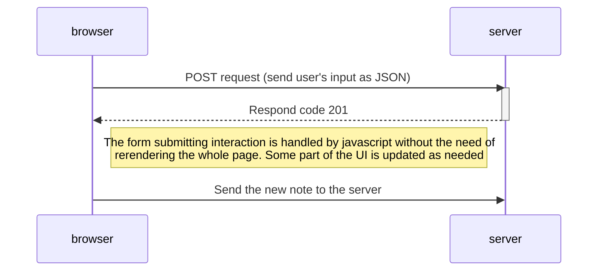

```mermaid
sequenceDiagram
    participant browser
    participant server

	browser->>server: POST request (send user's input as JSON)
    activate server
    server-->>browser: Respond code 201
    deactivate server

    Note right of browser: The form submitting interaction is handled by javascript without the need of <br> rerendering the whole page. Some part of the UI is updated as needed

    browser->>server: Send the new note to the server

```